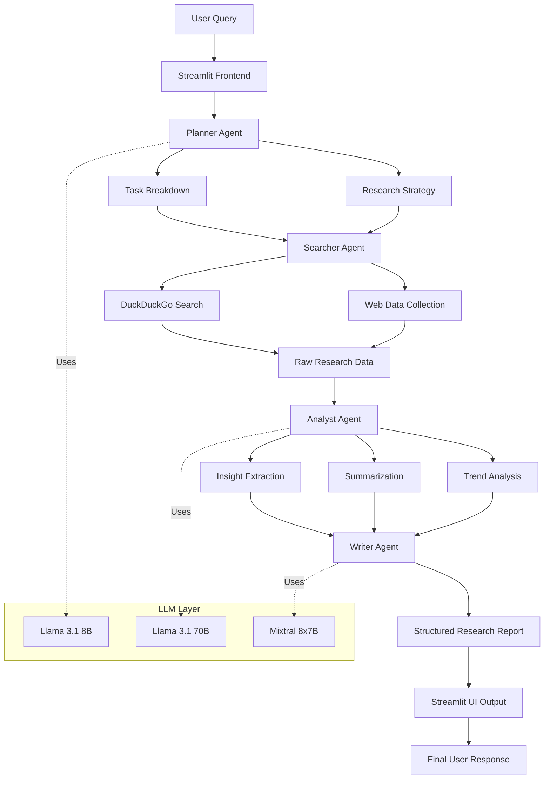

# AI Research Assistant Agent

An intelligent **Multi-Agent AI Research System** that automates the complete research workflow using multiple AI agents.
This project combines **LLMs, web search, analysis, and report generation** into a single automated pipeline.

---

# 🚀 Features

* Multi-Agent Architecture
* Automated Research Workflow
* Real-time Web Search
* AI-Powered Analysis
* Structured Report Generation
* Streamlit Web Interface
* Multiple LLM Support
* Parallel Agent Execution
* Research Paper Export
* Clean and Modular Codebase

---

# 🏗️ Architecture Diagram



---

# 🧠 How the System Works

The project uses multiple AI agents that collaborate together to solve research queries efficiently.

---

## 1️⃣ Planner Agent

The Planner Agent breaks the user query into smaller research tasks.

### Responsibilities

* Understand user intent
* Create research strategy
* Generate subtasks
* Manage workflow execution

### Example

For the query:

```text id="u7yz32"
Latest trends in Generative AI in 2025
```

The planner may generate:

* Research recent AI models
* Analyze industry trends
* Compare technologies
* Generate summary report

---

## 2️⃣ Searcher Agent

The Searcher Agent collects real-time information from the web.

### Responsibilities

* Perform internet searches
* Collect web data
* Gather research articles
* Fetch contextual information

### Tools Used

* DuckDuckGo Search
* Requests Library

---

## 3️⃣ Analyst Agent

The Analyst Agent analyzes all collected information deeply using LLMs.

### Responsibilities

* Extract insights
* Summarize findings
* Detect trends
* Analyze technical information

### AI Models

* Llama 3.1 70B
* Mixtral 8x7B

---

## 4️⃣ Writer Agent

The Writer Agent creates a professional final research report.

### Final Output Includes

* Introduction
* Key Findings
* Technical Analysis
* Future Scope
* Conclusion

---

# 🛠️ Tech Stack

## Programming Language

* Python

## Frameworks & Libraries

* Streamlit
* OpenAI API
* DuckDuckGo Search (DDGS)
* Requests
* XML
* Time

## AI Models

* Llama 3.1 8B
* Llama 3.1 70B
* Mixtral 8x7B

---

# 📂 Project Structure

```bash id="sl5vsl"
├── app.py
├── Research Assistant Agent.ipynb
├── requirements.txt
└── README.md
```

### Description

| File                             | Purpose                        |
| -------------------------------- | ------------------------------ |
| `app.py`                         | Streamlit frontend application |
| `Research Assistant Agent.ipynb` | Main development notebook      |
| `requirements.txt`               | Project dependencies           |
| `README.md`                      | Project documentation          |

---

# ⚙️ Installation

## Clone Repository

```bash id="cqdl53"
git clone <your-repository-link>
cd <repository-name>
```

---

## Install Dependencies

```bash id="u3uzb2"
pip install -r requirements.txt
```

---

# 🔑 API Key Setup

Add your API key inside the project:

```python id="95z11n"
from openai import OpenAI

client = OpenAI(
    api_key="YOUR_API_KEY"
)
```

---

# ▶️ Run the Application

## Run Streamlit App

```bash id="qcmc4g"
streamlit run app.py
```

---

# 💡 Example Research Queries

```text id="z0s2h4"
Latest trends in Generative AI in 2025
```

```text id="1ty3h0"
Future of AI Agents in Software Engineering
```

```text id="i6b6e3"
Applications of Multi-Agent Systems in Healthcare
```

---

# 🔄 Workflow Pipeline

1. User enters a research topic
2. Planner Agent creates subtasks
3. Searcher Agent collects web data
4. Analyst Agent processes information
5. Writer Agent generates report
6. Final output displayed in Streamlit UI

---

# 📸 Sample Output

The generated report may include:

* Research Summary
* Technical Insights
* Industry Trends
* AI Model Comparison
* Future Predictions
* References

---

# 🎯 Use Cases

* Academic Research
* AI Trend Analysis
* Market Research
* Technical Report Generation
* Automated Literature Review
* Industry Insights
* Competitive Analysis
* AI-Based Research Automation

---

# 🔥 Future Improvements

* Async Parallel Agent Execution
* PDF Export Support
* Citation Generation
* Vector Database Integration
* RAG Pipeline
* Long-Term Memory Agents
* Multi-Search Engine Support
* Research Visualization Dashboard
* Autonomous AI Research Agents

---

# 📈 Why This Project Matters

This project demonstrates practical implementation of:

* Multi-Agent AI Systems
* LLM Orchestration
* AI Workflow Automation
* Real-Time Research Pipelines
* Generative AI Applications
* Streamlit Deployment
* AI-Powered Information Retrieval

---

# 💼 Perfect For

This project is highly valuable for:

* AI Engineer Roles
* ML Engineer Roles
* Generative AI Engineer Roles
* Research Engineer Positions
* LLM Application Development
* AI Automation Projects

---

# 🤝 Contributing

Contributions are welcome.

Feel free to:

* Fork the repository
* Improve features
* Add new agents
* Optimize workflows
* Submit pull requests

---

# 📜 License

This project is licensed under the MIT License.

---

# 👨‍💻 Author

## Arnab Giri

* GitHub: [GitHub](https://github.com?utm_source=chatgpt.com)
* LinkedIn: [LinkedIn](https://www.linkedin.com?utm_source=chatgpt.com)

---

# ⭐ Support

If you found this project useful:

* Star the repository
* Share with others
* Contribute improvements
* Give feedback

---
